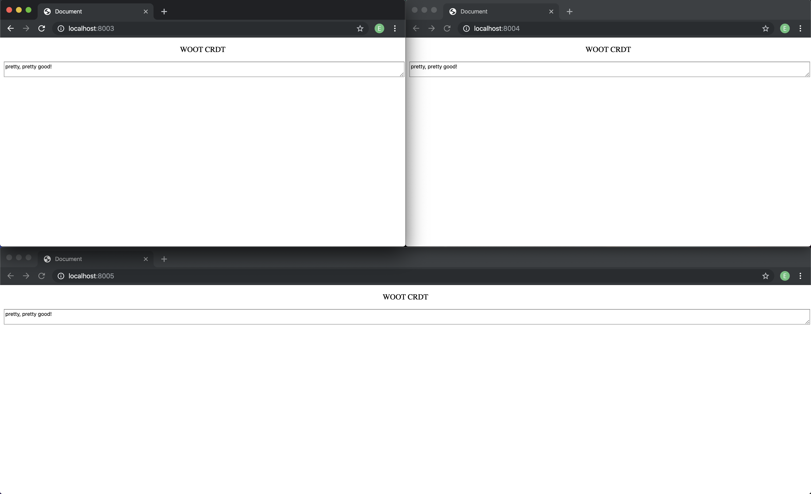

## WOOT CRDT

WOOT Collaborative Text CRDT Cluster implemented in Go & Docker



## Introduction

CRDTs (Commutative Replicated Data Types) are a certain form of data types that when replicated across several nodes over a network achieve eventual consistency without the need for a consensus round. WOOT CRDTs are CRDTs that facilitate text to be collaboratively edited and shared across multiple clients. It supports adding deleting and updating characters anywhere in the text document that converge to a shared text that is synced across all other clients.

## Steps

To provision the cluster:

```
$ git clone https://github.com/el10savio/woot-crdt
$ cd woot-crdt
$ make provision
```

This creates a 3 node WOOT cluster established in their own docker network.

To view the status of the cluster

```
$ make info
```

This provides information on the cluster and its associated ports to access each node. An example of the output seen in `make info` would be like below:

```
217351079e75  woot  "/go/bin/woot"  2 hours ago  Up 2 hours  0.0.0.0:8005->8080/tcp  peer-2
d3fd26dd4df3  woot  "/go/bin/woot"  2 hours ago  Up 2 hours  0.0.0.0:8004->8080/tcp  peer-1
8830feb6cd68  woot  "/go/bin/woot"  2 hours ago  Up 2 hours  0.0.0.0:8003->8080/tcp  peer-0
```


We can now open a browser window for each port in localhost (in the above case `localhost:8003`, `localhost:8004`, `localhost:8005`). This now opens up 3 text input web pages, when we add text in here they automatically get synced across all other nodes.

Now we can also send requests to add, list, and delete values to any peer node using its port allocated.

```
$ curl -i -X POST localhost:<peer-port>/woot/add -d {"value": <value>, "position": <position>}
$ curl -i -X POST localhost:<peer-port>/woot/remove -d {"position": <position>}
$ curl -i -X GET localhost:<peer-port>/woot/list
```

In the logs for each peer docker container, we can see the logs of the peer nodes getting in sync after each local operation.

To tear down the cluster and remove the built docker images:

```
$ make clean
```

This is not certain to clean up all the locally created docker images at times. You can do a docker rmi to delete them.

## References

- [ Real time group editors without Operational transformation](https://hal.inria.fr/inria-00071240/) [Gérald Oster et al]